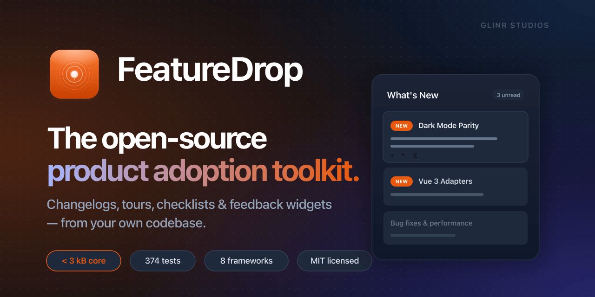

<p align="center">
  
</p>

<h1 align="center">FeatureDrop</h1>

<p align="center">
  <strong>The open-source product adoption toolkit.</strong><br />
  Changelogs • Tours • Checklists • Hotspots • Feedback — from your own codebase.<br />
  &lt; 3 kB core &nbsp;·&nbsp; Zero vendor lock-in &nbsp;·&nbsp; MIT licensed
</p>

<p align="center">
  <a href="https://github.com/GLINCKER/featuredrop/stargazers"></a>
  <a href="https://www.npmjs.com/package/featuredrop"></a>
  <a href="https://www.npmjs.com/package/featuredrop"></a>
  <a href="https://bundlephobia.com/package/featuredrop"></a>
  <a href="https://github.com/GLINCKER/featuredrop/blob/main/LICENSE"></a>
  <a href="https://featuredrop.dev"></a>
</p>

<p align="center">
  <a href="https://featuredrop.dev/docs/quickstart">Quickstart</a> &bull;
  <a href="https://featuredrop.dev/docs/components/gallery">Components</a> &bull;
  <a href="https://featuredrop.dev/playground">Playground</a> &bull;
  <a href="https://featuredrop.dev/docs/api">API Reference</a> &bull;
  <a href="#migration-from-beamer--pendo">Migration Guide</a>
</p>

<p align="center">
  
</p>


---

## Why FeatureDrop?

Every SaaS ships features. Users miss them. The usual options are bad:

| Option | Problem |
|---|---|
| **Beamer / Headway / AnnounceKit** | External widget, vendor lock-in, $49–399/mo |
| **Pendo / Appcues** | Feature flags AND onboarding, ~$7k+/yr |
| **Joyride / Shepherd.js** | Tours only, not persistence or changelog |
| **DIY** | You build it, forget expiry, badges stay forever |

**FeatureDrop** gives you a free, self-hosted middle path: production-ready adoption components that run inside your own React tree, powered by a JSON manifest you own.

---

## Quick Start

```bash
npm install featuredrop     # < 3 kB core, zero runtime dependencies
```

**1. Define your features:**

```ts
import { createManifest } from 'featuredrop'

export const features = createManifest([
  {
    id: 'dark-mode',
    label: 'Dark Mode',
    description: 'Full dark theme support across every surface.',
    releasedAt: '2026-03-01T00:00:00Z',
    showNewUntil: '2026-04-01T00:00:00Z',
    type: 'feature',
    priority: 'high',
    cta: { label: 'Try it', url: '/settings/appearance' },
  },
])
```

**2. Wrap your app:**

```tsx
import { FeatureDropProvider } from 'featuredrop/react'
import { LocalStorageAdapter } from 'featuredrop'
import { features } from './features'

<FeatureDropProvider manifest={features} storage={new LocalStorageAdapter()}>
  <App />
</FeatureDropProvider>
```

**3. Add badges and a changelog:**

```tsx
import { NewBadge, ChangelogWidget } from 'featuredrop/react'

// Sidebar nav item
<a href="/settings">
  Settings <NewBadge id="dark-mode" />           {/* auto-expires */}
</a>

// Changelog button  
<ChangelogWidget title="What's new" showReactions />
```

That's it. Badges expire on schedule. No database setup. No vendor account. No tracking pixels.

→ **Full walkthrough:** [10-minute quickstart](https://featuredrop.dev/docs/quickstart)

---

## Components

Everything you'd get from Beamer or Pendo, but free, self-hosted, and headless-first.

| Component | Description |
|---|---|
| `<ChangelogWidget>` | Trigger button + slide-out/modal changelog with emoji reactions |
| `<ChangelogPage>` | Full-page changelog with filters, search, and pagination |
| `<NewBadge>` | Auto-expiring pill / dot / count badge |
| `<Banner>` | Top-of-page or inline banner with `announcement`, `warning`, `info` variants |
| `<Toast>` | Stackable toast notifications with auto-dismiss and position control |
| `<Tour>` | Multi-step guided product tours with keyboard nav and persistence |
| `<Checklist>` | Onboarding task checklists with progress tracking |
| `<Spotlight>` | Pulsing DOM-attached beacon/tooltip |
| `<SpotlightChain>` | Chained spotlight walkthrough ("here are 3 new things") |
| `<AnnouncementModal>` | Priority-gated modal with optional image carousel |
| `<Hotspot>` / `<TooltipGroup>` | Persistent contextual hints with visibility caps |
| `<FeedbackWidget>` | In-app feedback with category, emoji, screenshot support |
| `<Survey>` | NPS / CSAT / CES / custom survey engine with trigger rules |
| `<FeatureRequestButton>` | Per-feature voting button with vote guard |
| `<FeatureRequestForm>` | Request capture + sortable request list |

All components are headless-capable via render props. [See live demos →](https://featuredrop.dev/docs/components/gallery)

---

## How It Works

```
  Manifest (static)                Storage (runtime)
  ┌─────────────────────┐         ┌──────────────────────┐
  │ releasedAt: Mar 1   │         │ watermark ← server   │
  │ showNewUntil: Apr 1 │         │ dismissed ← localStorage │
  └──────────┬──────────┘         └──────────┬───────────┘
             │                               │
             └──────────┐  ┌─────────────────┘
                        ▼  ▼
                ┌───────────────┐
                │   isNew()     │
                │               │
                │  !dismissed   │
                │  !expired     │
                │  afterWatermark│
                └───────┬───────┘
                        │
                   true / false
```

New users see everything (no watermark). Returning users see only features shipped since their last visit. Dismissals are instant (localStorage). "Mark all seen" syncs across devices with one optional server write.

Read the full [Architecture doc](https://featuredrop.dev/docs/concepts/architecture) for cross-device sync and custom adapter patterns.

---

## Storage Adapters

| Adapter | Import | Best For |
|---|---|---|
| `LocalStorageAdapter` | `featuredrop` | Browser apps (default) |
| `MemoryAdapter` | `featuredrop` | Testing, SSR |
| `IndexedDBAdapter` | `featuredrop/adapters` | Offline-first PWAs |
| `RemoteAdapter` | `featuredrop/adapters` | Server-backed with retry + circuit-breaker |
| `HybridAdapter` | `featuredrop/adapters` | Local + remote with batched flush |
| Redis / PostgreSQL / DynamoDB | `featuredrop/adapters` | Database-backed server-side apps |

[All adapters →](https://featuredrop.dev/docs/adapters/overview)

---

## CLI

Manage your manifest from the command line:

```bash
# Scaffold
npx featuredrop init
npx featuredrop add --label "Dark Mode" --category ui --type feature

# Validate & audit
npx featuredrop validate          # schema + duplicate ID check
npx featuredrop doctor            # security + best practice audit
npx featuredrop stats             # manifest summary stats

# Build (markdown → JSON)
npx featuredrop build --pattern "features/**/*.md" --out featuredrop.manifest.json

# Generate outputs
npx featuredrop generate-rss         --out featuredrop.rss.xml
npx featuredrop generate-changelog   --out CHANGELOG.generated.md

# Migrate from vendors
npx featuredrop migrate --from beamer      --input beamer-export.json
npx featuredrop migrate --from headway     --input headway-export.json
npx featuredrop migrate --from announcekit --input announcekit-export.json
npx featuredrop migrate --from canny       --input canny-export.json
npx featuredrop migrate --from launchnotes --input launchnotes-export.json
```

[CLI reference →](https://featuredrop.dev/docs/automation/ci)

---

## Framework Adapters

| Framework | Status | Import |
|---|---|---|
| React / Next.js | ✅ Stable | `featuredrop/react` |
| Vanilla JS | ✅ Stable | `featuredrop` |
| SolidJS | 🔬 Preview | `featuredrop/solid` |
| Preact | 🔬 Preview | `featuredrop/preact` |
| Web Components | 🔬 Preview | `featuredrop/web-components` |
| Angular | 🔬 Preview | `featuredrop/angular` |
| Vue 3 | 🔬 Preview | `featuredrop/vue` |
| Svelte 5 | 🔬 Preview | `featuredrop/svelte` |

---

## Headless Hooks (for shadcn / custom UI)

Don't want our components? Use hooks — **data + actions, zero JSX**:

```tsx
import { useChangelog } from 'featuredrop/react/hooks'
import { Sheet, SheetContent, SheetTrigger } from '@/components/ui/sheet'
import { Badge } from '@/components/ui/badge'

function MyChangelog() {
  const { newFeatures, newCount, dismiss, markAllSeen } = useChangelog()

  return (
    <Sheet onOpenChange={() => markAllSeen()}>
      <SheetTrigger>
        What's New {newCount > 0 && <Badge>{newCount}</Badge>}
      </SheetTrigger>
      <SheetContent>
        {newFeatures.map(f => (
          <div key={f.id} onClick={() => dismiss(f.id)}>
            <h3>{f.label}</h3>
            <p>{f.description}</p>
          </div>
        ))}
      </SheetContent>
    </Sheet>
  )
}
```

| Hook | Import | Returns |
|---|---|---|
| `useFeatureDrop()` | `featuredrop/react/hooks` | Full context: features, count, dismiss, throttle controls |
| `useNewFeature(key)` | `featuredrop/react/hooks` | `{ isNew, feature, dismiss }` |
| `useNewCount()` | `featuredrop/react/hooks` | Current unread badge count |
| `useChangelog()` | `featuredrop/react/hooks` | `{ features, newFeatures, newCount, dismiss, dismissAll, markAllSeen, getByCategory }` |
| `useTour(id)` | `featuredrop/react/hooks` | Imperative tour controls and step snapshot |
| `useTourSequencer(sequence)` | `featuredrop/react/hooks` | Ordered multi-tour orchestration |
| `useChecklist(id)` | `featuredrop/react/hooks` | Checklist progress + task controls |
| `useSurvey(id)` | `featuredrop/react/hooks` | Survey controls: `show`, `hide`, `askLater` |
| `useTabNotification()` | `featuredrop/react/hooks` | Browser tab title count: `"(3) My App"` |

> **When to use hooks vs components:** If your project uses shadcn/ui, Radix, or any custom design system, use hooks from `featuredrop/react/hooks`. If you want out-of-the-box UI, use components from `featuredrop/react`.

---

## AI-Native

FeatureDrop is built for the AI coding era. Your AI assistant already knows how to use it.

### Claude Code Plugin

```bash
# Install the plugin — Claude Code learns FeatureDrop's API automatically
/plugin install featuredrop
```

Then just ask: *"Add a changelog widget with auto-expiring badges to my app"* — Claude handles the rest.

### Cursor / Copilot

```bash
# Auto-detect your IDE and copy the right context files
npx featuredrop ai-setup
```

### Tailwind Plugin

```ts
// tailwind.config.ts
import { featureDropPlugin } from 'featuredrop/tailwind'

export default {
  plugins: [featureDropPlugin()],
  // Adds: fd-badge, fd-badge-dot, fd-badge-count, animations, CSS variables
  // Auto dark mode, reduced-motion support
}
```

---

## Notification Bridges

Fan out release notifications to Slack, Discord, email, webhooks, or RSS on deploy:

```ts
import { SlackBridge, DiscordBridge, WebhookBridge, EmailDigestGenerator, RSSFeedGenerator } from 'featuredrop/bridges'

await SlackBridge.notify(feature, { webhookUrl: process.env.SLACK_WEBHOOK! })
await DiscordBridge.notify(feature, { webhookUrl: process.env.DISCORD_WEBHOOK! })
await WebhookBridge.post(feature, { url: 'https://api.example.com/hooks/features' })

const html = EmailDigestGenerator.generate(features, { title: 'Weekly Product Updates' })
const rss  = RSSFeedGenerator.generate(features, { title: 'Product Updates' })
```

---

## Analytics

Pipe adoption events to any analytics provider:

```tsx
<FeatureDropProvider
  manifest={features}
  storage={storage}
  analytics={{
    onFeatureSeen:      (f) => posthog.capture('feature_seen',      { id: f.id }),
    onFeatureDismissed: (f) => posthog.capture('feature_dismissed', { id: f.id }),
    onFeatureClicked:   (f) => posthog.capture('feature_clicked',   { id: f.id }),
    onWidgetOpened:     ()  => posthog.capture('changelog_opened'),
  }}
>
  <App />
</FeatureDropProvider>
```

Works with PostHog, Mixpanel, Amplitude, Segment, or any custom endpoint.

---

## User Segmentation

Show the right features to the right users:

```tsx
<FeatureDropProvider
  manifest={features}
  storage={storage}
  userContext={{ plan: 'pro', role: 'admin', region: 'eu' }}
>
  <App />
</FeatureDropProvider>
```

Define audience rules per feature in your manifest:

```json
{
  "id": "ai-copilot",
  "label": "AI Copilot",
  "audience": { "plan": ["pro", "enterprise"], "region": ["us", "eu"] }
}
```

Users outside the audience never see the feature. No server calls. No feature flag service needed.

---

## CI Integration

Validate your manifest in every pull request:

```ts
import {
  diffManifest,
  generateChangelogDiff,
  generateChangelogDiffMarkdown,
  validateManifestForCI
} from 'featuredrop/ci'

const diff       = diffManifest(beforeManifest, afterManifest)
const summary    = generateChangelogDiff(diff, { includeFieldChanges: true })
const markdown   = generateChangelogDiffMarkdown(diff, { includeFieldChanges: true })
const validation = validateManifestForCI(afterManifest)
```

```bash
pnpm size-check   # bundle budget check post-build
```

[CI setup guide →](https://featuredrop.dev/docs/automation/ci)

---

## Migration from Beamer / Pendo

```bash
npx featuredrop migrate --from beamer --input beamer-export.json --out features.json
```

| | Beamer | Pendo | **FeatureDrop** |
|---|---|---|---|
| Price | $59–399/mo | $7k+/yr | **Free forever** |
| Bundle impact | External script | ~300 kB agent | **< 3 kB core** |
| Vendor lock-in | Yes | Yes | **No** |
| Data ownership | Vendor-hosted | Vendor-hosted | **Your repo** |
| Customization | CSS themes | Limited | **Full source access** |

[Full migration guide →](https://featuredrop.dev/docs/migration)

---

## Full Comparison

| | FeatureDrop | Beamer | Headway | AnnounceKit | Pendo |
|---|:---:|:---:|:---:|:---:|:---:|
| **Price** | **Free** | $59–399/mo | $49–249/mo | $79–299/mo | $7k+/yr |
| Auto-expiring badges | ✅ | — | — | — | — |
| Changelog widget | ✅ | ✅ | ✅ | ✅ | ✅ |
| Product tours | ✅ | — | — | — | ✅ |
| Onboarding checklists | ✅ | — | — | — | ✅ |
| Spotlight / beacon | ✅ | — | — | — | — |
| Hotspot tooltips | ✅ | — | — | — | — |
| Announcement modal | ✅ | — | — | — | — |
| Toast notifications | ✅ | — | — | — | — |
| Feedback & surveys | ✅ | — | — | — | ✅ |
| Feature request voting | ✅ | — | — | — | — |
| Tab title notification | ✅ | — | — | — | — |
| Zero runtime deps (core) | ✅ | — | — | — | — |
| Framework agnostic | ✅ | — | — | — | — |
| Headless mode | ✅ | — | — | — | — |
| Analytics callbacks | ✅ | ✅ | ✅ | ✅ | ✅ |
| Self-hosted | ✅ | — | — | — | — |
| Open source | ✅ | — | — | — | — |

---

## Documentation

| Resource | Description |
|---|---|
| [**Live Docs**](https://featuredrop.dev) | Full documentation site |
| [Quickstart](https://featuredrop.dev/docs/quickstart) | Ship your first badge in 10 minutes |
| [Component Gallery](https://featuredrop.dev/docs/components/gallery) | Live interactive demos |
| [Playground](https://featuredrop.dev/playground) | Local sandbox + hosted templates |
| [API Reference](https://featuredrop.dev/docs/api) | All functions, hooks, and components |
| [Migration Guide](https://featuredrop.dev/docs/migration) | Migrate from Beamer, Pendo, Headway |
| [Architecture](https://featuredrop.dev/docs/concepts/architecture) | Three-check algorithm, cross-device sync |
| [Recipes](https://featuredrop.dev/docs/recipes) | Copy-paste integration patterns |
| [Frameworks](https://featuredrop.dev/docs/frameworks/vue) | Vue, Svelte, Solid, Angular, Preact, Web Components |

---

## Branding Assets

All marketing assets are in [`apps/docs/public/og/`](apps/docs/public/og/).

| File | Ratio | Use |
|---|---|---|
| `og.png` | 1200×630 (1.91:1) | Website OG / link previews, Discord, Slack |
| `github-social.png` | 1280×640 (2:1) | **GitHub repo social preview** ← upload this |
| `twitter-header.png` | 1500×500 (3:1) | X.com profile header |
| `linkedin-banner.png` | 1584×396 (4:1) | LinkedIn company page banner |
| `reddit-16x9.png` | 1920×1080 (16:9) | Reddit posts, r/reactjs, r/webdev |
| `producthunt.png` | 1270×760 | Product Hunt launch |
| `story-9x16.png` | 1080×1920 (9:16) | Instagram / LinkedIn Stories |

**GitHub social preview**: Repo **Settings → Social preview → Upload** `apps/docs/public/og/github-social.png`.

---

## Contributing

See [CONTRIBUTING.md](CONTRIBUTING.md) for dev setup, commit conventions, and release process.

## Security

- Report vulnerabilities privately via [SECURITY.md](SECURITY.md)
- CI includes CodeQL static analysis on PRs and `main`
- `pnpm security-check` scans runtime source for unsafe execution patterns

## License

MIT © [GLINR STUDIOS](https://glincker.com)

---

<p align="center">
  <sub>Built and battle-tested at <a href="https://askverdict.ai">AskVerdict AI</a>.</sub><br />
  <strong>A <a href="https://glincker.com">GLINR STUDIOS</a> open source project.</strong>
</p>
